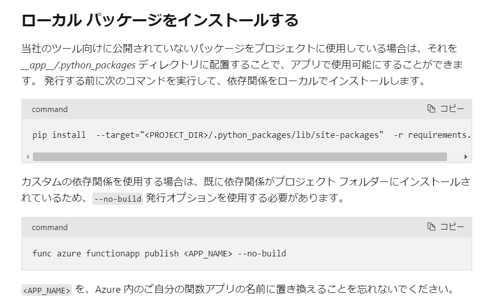

# code-snippet

# 部署

### 错误 ERROR: Could not install packages due to an OSError

- 1021
- 手动上传 zip 包到 C:\home\data\SitePackages
- 上传之后，手动修改 C:\home\data\SitePackages\packagename.txt ，此文件只需要输入 zip 包的文件名即可。
- https://learn.microsoft.com/zh-cn/azure/azure-functions/functions-deployment-technologies?tabs=windows#trigger-syncing
- [Azure Functions Python 开发人员指南](https://learn.microsoft.com/zh-cn/azure/azure-functions/functions-reference-python?tabs=get-started%2Casgi%2Capplication-level&pivots=python-mode-decorators#environment-variables)
- [从 Azure 中的包文件运行函数](https://learn.microsoft.com/zh-cn/azure/azure-functions/run-functions-from-deployment-package)
- [Azure Functions 中的部署技术](https://learn.microsoft.com/zh-cn/azure/azure-functions/functions-deployment-technologies?tabs=windows#trigger-syncing)
- この2つの方法をもう一度試したいと思います
- 1.パッケージをローカルにインストールしてから、--no-build パラメーターを使用してデプロイする（昨日間違えました、oryx build をスキップするわけではない）。
  
- 2.ZIP ファイルとパッケージを別々にアップロードする（昨日、パッケージを間違ったパスに置いてしまいました）。

- 1020
- https://www.shanebart.com/az-func-internal-server-500-error/
- https://learn.microsoft.com/en-us/azure/azure-functions/functions-scale#service-limits
- https://learn.microsoft.com/zh-cn/azure/storage/files/storage-how-to-use-files-portal?tabs=azure-portal

- 删除 home 下的旧 deploy 文件
- 把模型放到 azure files 或者 blob storage
- 查看 package 安装目录
- 预先在服务器安装 package？

```
文件系统查看命令：df
通过 df 命令可以査看已经挂载的文件系统的信息包括设备文件名、文件系统总大小、已经使用的大小、剩余大小、使用率和挂载点等。df 命令格式如下：
df [选项] [挂载点或分区设备文件名]
-h	使用习惯单位显示容量，如 KB、MB 或 GB 等

统计目录或文件所占磁盘空间大小：du
du [选项] [目录或文件名]
-a	显示每个子文件的磁盘占用量。默认只统计子目录的磁盘占用量
-h	使用习惯单位显示磁盘占用量，如 KB、MB 或 GB 等
-s	统计总磁盘占用量，而不列出子目录和子文件的磁盘占用量

只统计磁盘占用量总的大小，同时使用习惯单位显示
du -sh

du命令和df命令的区别
使用 du 命令和 df 命令去统计分区的使用情况时，得到的数据是不一样的。那是因为df命令是从文件系统的角度考虑的，通过文件系统中未分配的空间来确定文件系统中已经分配的空间大小。也就是说，在使用 df 命令统计分区时，不仅要考虑文件占用的空间，还要统计被命令或程序占用的空间（最常见的就是文件已经删除，但是程序并没有释放空间）。

而 du 命令是面向文件的，只会计算文件或目录占用的磁盘空间。也就是说，df 命令统计的分区更准确，是真正的空闲空间。

ls -la    # 显示所有文件的详细信息
ls -lh    # h表示human readable，文件大小以易读方式显示(KB,MB,GB)
```

1.检查当前空间使用情况 2.清理空间 3.修改部署方式

- .deployment pip install --no-cache-dir -r requirements.txt
- 减少不必要的包
- 修改应用程序设置 4.增加存储配额，在应用设置中添加：WEBSITE_CONTENTSHARE_SIZE = 2 # 增加到 2GB

## kudo console

- https://learn.microsoft.com/en-us/azure/app-service/resources-kudu
- https://cloud-right.com/2016/07/azure-functions-kudu/
- https://stackoverflow.com/questions/78075199/im-having-a-problem-with-my-application-on-azure-web-app

- 1.直接在 wwwroot 安装依赖
- 2.把 tmp 挂到 blob storage
